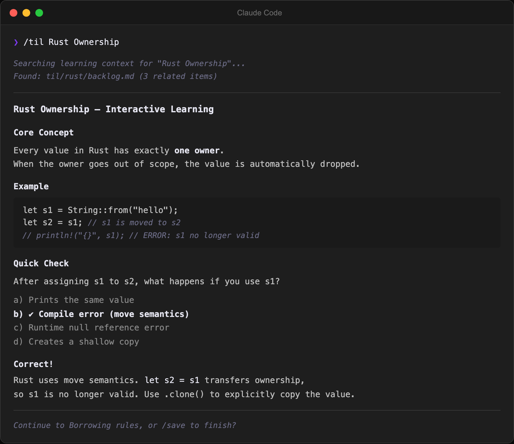

# Oh My TIL

[](LICENSE)
[](https://obsidian.md)
[](https://github.com/SongYunSeop/oh-my-til/releases)

**English** | [한국어](README.ko.md)

A Claude Code plugin for AI-powered TIL (Today I Learned) learning workflow. Works as a standalone CLI (`npx oh-my-til`) or as an Obsidian plugin with embedded Claude Code terminal.



## Features

- **Embedded Terminal** — Claude Code terminal in Obsidian sidebar (xterm.js + node-pty)
- **Built-in MCP Server** — Claude Code can directly access your vault via HTTP
- **Learning Dashboard** — TIL statistics and category breakdown at a glance
- **Auto-installed Skills** — `/til`, `/research`, `/backlog`, `/save`, `/til-review`, `/dashboard` commands ready out of the box
- **Spaced Repetition (SRS)** — SM-2 algorithm-based review scheduling for TIL notes
- **Markdown Link Detection** — `[text](path)` links in terminal are clickable and open notes (CJK-aware)
- **Backlog-to-TIL Trigger** — Click an empty backlog link to start a TIL session
- **File Watcher** — Newly created TIL files open automatically in the editor

## How It Works

```
Command Palette → Open Terminal → Claude Code starts
→ Run /til, /backlog, /research, /save, /til-review, /dashboard skills
→ Claude researches → interactive learning → saves TIL markdown
→ New file detected → opens in editor
```

## Installation

### Option A: Claude Code Plugin (Recommended)

Install directly as a Claude Code plugin — skills, MCP server, and hooks are auto-registered.

**Prerequisites:** [Node.js](https://nodejs.org) 18+ / [Claude Code](https://docs.anthropic.com/en/docs/claude-code) v1.0.33+

```bash
# Add marketplace (project scope recommended — only active in this TIL vault)
claude plugin marketplace add https://github.com/SongYunSeop/oh-my-til.git --scope project

# Install plugin
claude plugin install oh-my-til@oh-my-til --scope project
```

Skills are namespaced: `/oh-my-til:til`, `/oh-my-til:research`, `/oh-my-til:backlog`, etc.

### Option B: Standalone CLI (without Obsidian)

No git clone needed. Just `npx`.

**Prerequisites:** [Node.js](https://nodejs.org) 18+ / [Claude Code CLI](https://docs.anthropic.com/en/docs/claude-code) (`claude`)

1. **Initialize** — creates the directory (if needed) and installs skills, rules, and CLAUDE.md config. If an Obsidian vault is detected (`.obsidian/` exists), the plugin is auto-installed too:

   ```bash
   npx oh-my-til init ~/my-til
   npx oh-my-til init ~/my-til --no-obsidian  # Skip Obsidian plugin installation
   ```

2. **Start Claude Code** and use `/til`, `/research`, `/backlog` skills right away:

   ```bash
   cd ~/my-til
   claude
   ```

3. **(Optional) Start MCP server** — lets Claude Code query your TIL files:

   ```bash
   # HTTP mode — runs a persistent server
   npx oh-my-til serve ~/my-til
   claude mcp add --transport http oh-my-til http://localhost:22360/mcp

   # stdio mode — spawned on demand (no server needed, works with Claude Desktop)
   claude mcp add oh-my-til -- npx oh-my-til mcp ~/my-til
   ```

> **Tip:** You can also run `npx oh-my-til init` without a path to initialize the current directory.

### Option C: Obsidian Plugin

**Prerequisites:** [Obsidian](https://obsidian.md) v1.5.0+ / [Node.js](https://nodejs.org) 18+ / [Claude Code CLI](https://docs.anthropic.com/en/docs/claude-code) (`claude`)

#### Using npx (Recommended)

Run `init` inside your Obsidian vault — the plugin is installed automatically:

```bash
npx oh-my-til init /path/to/your/vault
```

Electron version is auto-detected on macOS. To override:

```bash
ELECTRON_VERSION=37.10.2 npx oh-my-til init /path/to/your/vault
```

> To find your Electron version, open Obsidian's Developer Tools (Ctrl+Shift+I) and run `process.versions.electron`.

#### Manual Installation (from source)

```bash
git clone https://github.com/SongYunSeop/oh-my-til.git
cd oh-my-til
npm install
ELECTRON_VERSION=<your-electron-version> npm run deploy -- /path/to/your/vault
```

After installation, restart Obsidian and enable **Oh My TIL** in Settings > Community plugins.

#### MCP Server Setup (Optional)

The plugin includes a built-in MCP server so Claude Code can access your vault directly:

```bash
claude mcp add --transport http oh-my-til http://localhost:22360/mcp
```

## Configuration

| Setting | Default | Description |
|---------|---------|-------------|
| Shell Path | System default | Shell to use in the terminal |
| Auto Launch Claude | `true` | Run `claude` when terminal opens |
| Resume Last Session | `false` | Resume previous Claude session (`--continue`) |
| Font Size | `13` | Terminal font size (px) |
| Font Family | `Menlo` | Terminal font (Menlo, SF Mono, Fira Code, JetBrains Mono, etc.) |
| Line Height | `1.0` | Terminal line spacing (1.0 = default, up to 2.0) |
| TIL Path | `til` | TIL folder path |
| Auto Open New TIL | `true` | Open new TIL files in editor automatically |
| Open Dashboard on Startup | `false` | Open learning dashboard when Obsidian starts |
| Claude Args | *(empty)* | Additional arguments passed to `claude` command |

## MCP Tools

When the MCP server is connected, Claude Code can use these tools:

| Tool | Description |
|------|-------------|
| `til_list` | List TIL files grouped by category (supports `search` filter) |
| `til_save_note` | Save a TIL note with validated frontmatter and path conventions (auto backlog check) |
| `til_backlog_status` | Backlog progress summary with checkbox counts |
| `til_backlog_check` | Mark a backlog item as done by slug (standalone use) |
| `til_get_context` | Get existing knowledge context for a topic (files, links, unresolved mentions) |
| `til_recent_context` | Recent learning activity grouped by date |
| `til_dashboard` | Learning statistics summary |
| `til_review_list` | Due review cards list + stats (SRS, supports `include_content`) |
| `til_review_update` | Record review result or remove from review |

## Claude Skills

The plugin auto-installs these skills to `.claude/skills/`:

| Skill | Command | Description |
|-------|---------|-------------|
| **til** | `/til <topic> [category]` | Research a topic → interactive learning → save TIL |
| **research** | `/research <topic> [category]` | Research a topic and create a learning backlog |
| **backlog** | `/backlog [category]` | View learning backlog and progress |
| **save** | *(auto-invoked by /til)* | Save TIL markdown with Daily note, MOC, and backlog updates |
| **til-review** | `/til-review [category]` | SRS-based spaced repetition review session (SM-2 algorithm) |
| **dashboard** | `/dashboard` | Learning dashboard — stats, activity heatmap, categories, backlog progress |
| **omt-setup** | `/omt-setup [subcommand]` | Unified setup — init, deploy, and manage oh-my-til |
| **setup-obsidian** | `/setup-obsidian` | Install the Obsidian desktop plugin in the current vault |

## Development

```bash
npm run dev              # Watch mode (esbuild)
npm test                 # Run tests (vitest)
npm run rebuild-pty      # Rebuild node-pty for Obsidian's Electron
npm run deploy -- /path  # Deploy to vault
npm run deploy -- --refresh-skills /path  # Deploy with skill/rule refresh
```

### Project Structure

```
src/
├── core/                    # Platform-independent pure logic
│   ├── backlog.ts           # Backlog parsing/formatting (pure functions)
│   ├── context.ts           # Learning context helpers (pure functions)
│   ├── stats.ts             # TIL statistics (pure functions)
│   ├── srs.ts               # Spaced repetition (SM-2 algorithm, review cards/stats)
│   ├── migrate-links.ts     # Wikilink [[]] → [](path) conversion (internal utility)
│   ├── keyboard.ts          # Shift+Enter → \n (multiline support)
│   ├── env.ts               # macOS PATH resolution (Homebrew)
│   ├── skills.ts            # Version comparison / placeholder substitution
│   ├── cli.ts               # CLI argument parsing (pure functions)
│   ├── config.ts            # Config file parsing/loading (pure functions)
│   ├── markdown.ts          # Markdown → HTML conversion (no external deps)
│   ├── profile.ts           # Static site page generation (profile, TIL pages, category index)
│   └── index.ts             # Barrel export
├── ports/                   # Adapter interfaces
│   ├── storage.ts           # FileStorage interface
│   └── metadata.ts          # MetadataProvider interface
├── adapters/                # Port implementations
│   ├── fs-adapter.ts        # node:fs based (standalone)
│   └── obsidian-adapter.ts  # Obsidian App based
├── mcp/                     # MCP server (port-dependent, Obsidian-free)
│   ├── context.ts           # Learning context tools (topic matching, category extraction)
│   ├── server.ts            # HTTP server + Streamable HTTP transport
│   └── tools.ts             # MCP tool definitions (FileStorage + MetadataProvider)
├── plugin-install.ts        # Plugin asset auto-install/update (skills, agents, CLAUDE.md section)
├── cli/                     # Standalone CLI entry point
│   ├── index.ts             # npx oh-my-til init / serve / mcp / install-obsidian / deploy
│   └── obsidian-install.ts  # Auto-install Obsidian plugin (Electron detection, node-pty rebuild)
└── obsidian/                # Obsidian platform adapter
    ├── main.ts              # Plugin entry point
    ├── settings.ts          # Settings tab & interface
    ├── watcher.ts           # File watcher → open in editor
    ├── terminal/
    │   ├── TerminalView.ts  # Sidebar terminal (ItemView + xterm.js)
    │   ├── MarkdownLinkProvider.ts  # 3 ILinkProviders: Markdown, Filepath, OSC 8
    │   └── pty.ts           # PTY process manager (node-pty)
    └── dashboard/
        └── DashboardView.ts # Learning dashboard (ItemView)
```

### Tech Stack

| | |
|---|---|
| **Runtime** | TypeScript, Obsidian Plugin API |
| **Terminal** | xterm.js, node-pty |
| **MCP** | @modelcontextprotocol/sdk |
| **Build** | esbuild |
| **Test** | vitest |

## Roadmap

- [x] Embedded Claude Code terminal
- [x] Built-in MCP server
- [x] Learning dashboard (basic stats)
- [x] Standalone CLI (`npx oh-my-til`) — use without Obsidian
- [x] Spaced Repetition (SRS) — SM-2 based review scheduling
- [ ] Backlog progress bars in dashboard
- [ ] Configurable TIL folder path
- [ ] Rich dashboard — recent TILs, streaks, weekly summary
- [ ] Dynamic code blocks (`til-moc`, `til-daily`) — auto-render TIL lists without Dataview
- [ ] Multi-terminal tabs — run multiple Claude Code sessions
- [ ] Note linking — auto-insert backlinks to related notes

## Acknowledgments

- [claude-code-terminal](https://github.com/dternyak/claude-code-terminal) — Original xterm.js + node-pty Obsidian integration pattern
- [Obsidian Developer Docs](https://docs.obsidian.md/Home)
- [MCP TypeScript SDK](https://github.com/modelcontextprotocol/typescript-sdk)

## License

[MIT](LICENSE)
